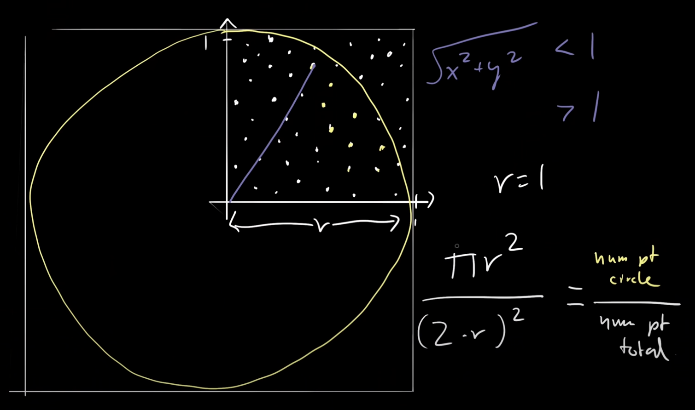
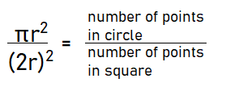
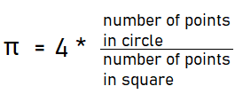
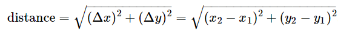
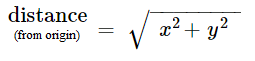
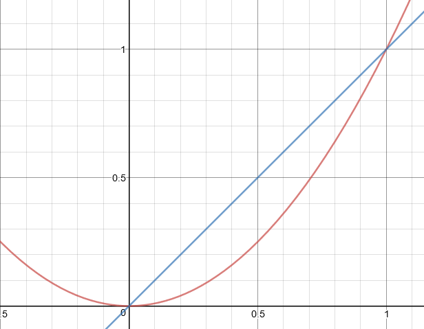

# RandomEstimatePi

Source: Joma Tech
https://www.youtube.com/watch?v=pvimAM_SLic

## Problem:
#### Given a function that returns a random value between 0 and 1 with uniform distribution, calculate pi.

### Draw a circle

First, we consider that we can use two random values for x and y coordinates.
By calculating coordinates for n number of times, we can create a uniform plot distribution on a coordinate graph.
Using this plot graph, we can visualize it as a quadrant of a circle with a radius of length 1.

We can see the visualization here, along with some formulas we will be using:

### Solve for Pi

We then consider that the ratio of the area of a circle to the area of a square (with the same radius), is the same as the ratio of the number of points in a circle to the number of points in a square (with the same radius).
This ratio allows us to find our pi value, shown in this equation:

After isolating the equation for pi, we get this:

### Distance

Finally, we need to understand which randomly generated coordinates are actually within the circle.
This can be done by checking if the distance from the origin to the coordinate is less than or equal to the radius of 1.

This is the normal formula for the distance between two points:

However, since we are finding the distance from the origin (0, 0), we can instead simplify the equation to this:

However, since we are only checking whether distance is less than or equal to 1, we can skip the square root calculation.
This is because the square root of a number less than 1 is always less than 1, and vice versa for greater than 1.

#### Proof: Here is a graph of y=x^2 (red) and y=x (blue)
If we consider x = distance = sqrt(x^2 + y^2), then we can see that values below 1 are still below 1 when squared, and values above 1 are still above 1 when squared.

Knowing this, we can directly compare distance <= 1

Then, we increment the total number of points in the square, and *if distance <= 0* increment the total number of points in the circle if distance.

Finally, we return 4 * the ratio of ( number of points in circle / number of points in square )
